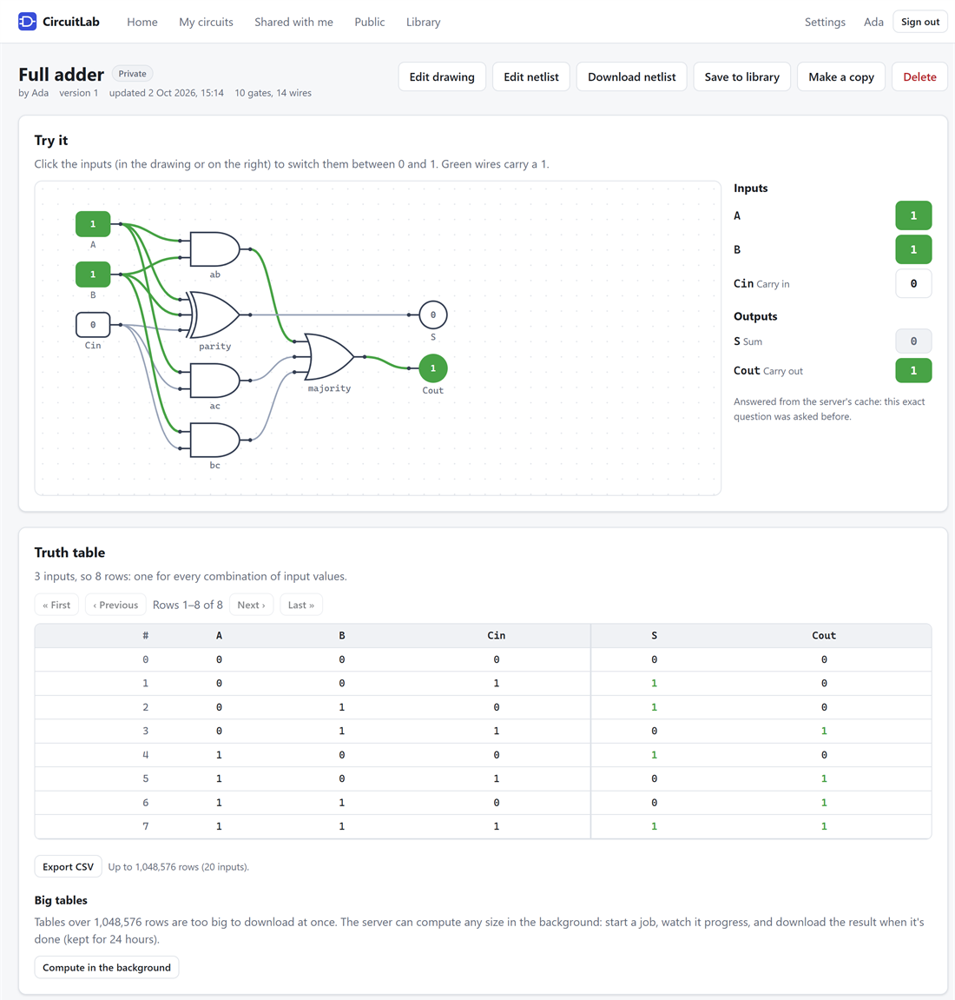
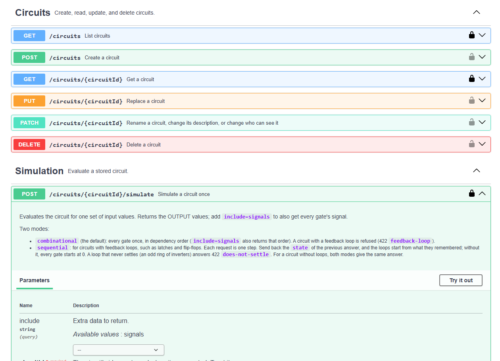
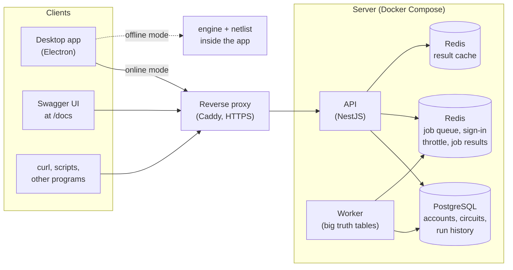

# CircuitLab

[](https://github.com/Nameless770/CircuitLab/actions/workflows/ci.yml)

Build digital logic circuits, flip their inputs, and watch the signals flow.

CircuitLab is a circuit simulator in three parts: a **desktop app** for drawing and testing circuits
(online, with an account, or offline, with nothing but the app); a **REST API** that stores circuits in
PostgreSQL, simulates them, and serves many people at once; and the **TypeScript libraries** both are
built on (a simulation engine, a netlist file format, a worker-thread runner). It was built as an
internship project, in 13 phases (see the [roadmap](#roadmap)), and every phase has a document that
explains what was built and why.

<p align="center">
  
</p>

## What it does

- **Draw a circuit, or write it as text,** then click its inputs and watch every wire light up. The
  gates are AND, OR, NAND, NOR, XOR, XNOR, NOT and BUF, plus constants, inputs and outputs.
- **Truth tables of any size.** Page through them, export them as CSV, or let the server compute a
  huge one in the background and download it when it's done.
- **Latches and flip-flops.** A circuit with a feedback loop runs step by step and remembers its state
  between steps.
- **An assistant that drafts circuits.** Describe one in words ("a 2-to-1 multiplexer with inputs D0, D1
  and SEL") and a language model running on your own computer, in [Ollama](https://ollama.com), drafts
  it. You see its truth table and check it before it goes in the editor
  ([docs/assistant.md](docs/assistant.md)).
- **Offline or online.** Offline, circuits live in the app's library and the app simulates them
  itself. Online, they live in your account: private, public, or shared with other people as viewers
  or editors.
- **A documented API.** Every endpoint is described in [openapi.yaml](packages/api-contract/openapi.yaml),
  and the running server shows it at `/docs`, where each endpoint can be tried.

<p align="center">
  
</p>

## Try it

**The API and its documentation** (needs [Docker](https://docs.docker.com/get-started/get-docker/)):

```bash
docker compose up --build
```

Open http://localhost:3000: it leads to the API documentation. Use "Try it out" on `POST /auth/register`
to make an account, then "Authorize" with the `accessToken` you get back, and every other endpoint
works as you. [docs/docker.md](docs/docker.md) explains what that command starts.

**The desktop app:**

```bash
npm install
npm run dev:desktop
```

Offline mode needs nothing else. For online mode, have the API running too (the command above, or
`npm run start:api`). [The desktop app](#the-desktop-app) describes both modes, and how to make an
installer.

**The libraries,** from TypeScript:

```ts
import { compileCircuit, simulate, truthTable } from "@circuitlab/engine";

const compiled = compileCircuit(circuitJson);            // validates and sorts once
simulate(compiled, { A: 1, B: 0 });                      // { outputs, signals, order }
truthTable(compiled, { offset: 0, limit: 100 });         // one page of rows
```

[docs/libraries.md](docs/libraries.md) covers the engine, the netlist format and the worker pool.

## How it fits together



The API keeps nothing between requests, so any number of copies can run side by side; the worker is
the same program started differently. The reverse proxy exists only when the API is put online
([docs/deploy.md](docs/deploy.md)). [docs/architecture.md](docs/architecture.md) goes further, with
the package structure and the journey of one simulation and of one background job.

## Documentation

| Document | What it explains |
| --- | --- |
| [architecture.md](docs/architecture.md) | How it fits together: what runs, which package builds on which, one request from end to end |
| [api-design.md](docs/api-design.md) | Why the REST API looks the way it does |
| [auth-design.md](docs/auth-design.md) | Accounts, tokens, and who may do what |
| [database-design.md](docs/database-design.md) | Why the database looks the way it does |
| [caching-and-jobs.md](docs/caching-and-jobs.md) | The result cache, background jobs, and what lives in Redis |
| [design-patterns.md](docs/design-patterns.md) | The patterns in the code, and why each one is there |
| [testing.md](docs/testing.md) | How it is tested, and what the tests found |
| [desktop-app.md](docs/desktop-app.md) | The desktop app: how it works, the decisions, its known shortcuts |
| [assistant.md](docs/assistant.md) | The assistant: why the model writes formulas, how a draft is checked, and how good it is (measured) |
| [docker.md](docs/docker.md) | What runs in Docker, and why it's built this way |
| [system-design.md](docs/system-design.md) | Scaling to thousands of users, with the measurements behind it |
| [deploy.md](docs/deploy.md) | Putting it online: HTTPS, secrets, backups |
| [libraries.md](docs/libraries.md) | Using the engine, the netlist reader and the worker pool as libraries |

## Project layout

Everything compiles to CommonJS with tsc, except the desktop app, which Vite bundles.

```
packages/engine/        @circuitlab/engine        data model, validation, sorting, simulation, truth tables
                                                  (pure TypeScript: no Node or framework imports)
packages/netlist/       @circuitlab/netlist       reads and writes netlist files, streaming
packages/assistant/     @circuitlab/assistant     drafts circuits with a model running in Ollama, and checks every draft
packages/runner/        @circuitlab/runner        SimulationPool: runs simulations on worker threads
packages/api-contract/  @circuitlab/api-contract  openapi.yaml, plus the framework-free code that enforces it
packages/database/      @circuitlab/database      PostgreSQL 18 migrations, schema.prisma, the Prisma Client, a local dev server
apps/api/               @circuitlab/api           the NestJS app (and the worker that shares its code)
apps/desktop/           @circuitlab/desktop       the desktop app: electron/ (main process), src/ (the window)
docs/                   the design documents (see Documentation above), and docs/images/
scripts/load/           the load, scale-out and job-timing scripts behind docs/system-design.md
Dockerfile              the API's image (also runs the worker and the migrations)
docker-compose.yml      PostgreSQL, Redis, the migrations, the API and a worker: `docker compose up`
docker-compose.prod.yml laid over it to go online: HTTPS (Caddy), required secrets, memory limits
deploy/Caddyfile        the reverse proxy's configuration
examples/               demos, and sample netlists in examples/netlists/
*/test/                 each package's tests (Vitest)
```

**How the pieces depend on each other:**
- The engine depends on nothing.
- The netlist and runner packages depend only on the engine.
- The assistant depends on the engine and the netlist package, and only the desktop app uses it.
- The API contract depends on those three.
- The database package depends on nothing at runtime but Prisma (its check uses the engine and netlist).
- The app depends on all of them.
- The desktop app runs the engine, netlist and assistant packages itself, and talks to the API over HTTP
  online (it only imports the contract's *types*).

## Commands

```bash
npm install
docker compose up --build  # phase 11: everything at once (API on http://localhost:3000), see docs/docker.md
docker compose -f docker-compose.yml -f docker-compose.prod.yml up -d --build  # phase 13: on a server, behind HTTPS, see docs/deploy.md
npm run build          # tsc -b: builds every package, then the examples
npm test               # phase 8: builds, type-checks the tests, runs all of them (needs Docker running, for Redis)
npm run test:coverage  # the same, with a coverage report in coverage/
npm run demo           # phase 1: truth tables and engine error messages
npm run demo:netlist   # phase 2: importing netlist files with streams
npm run demo:async     # phase 2: simulations on worker threads
npm run demo:api       # phase 3: the API's answers, request by request
npm run demo:http      # phase 4: the real server, driven over HTTP
npm run demo:auth      # phase 7: accounts, sharing, and tokens, over HTTP
npm run demo:patterns  # phase 9: the gate registry, both simulation strategies, an injected clock
npm run demo:jobs      # phase 10: the result cache, and a 2-million-row truth table as a background job
npm run start:api      # phase 4: runs the API on http://localhost:3000/v1
npm run start:worker   # phase 10: a worker process that computes truth-table jobs (needs REDIS_URL)
npm run dev:desktop    # the desktop app, with hot reload (run start:api too, for online mode)
npm run start:desktop  # the desktop app, built as users get it
npm run smoke:desktop  # clicks through the real desktop app (Playwright); screenshots in apps/desktop/dist/smoke/
npm run eval:assistant # how good is the assistant with the model you have? Needs Ollama running (docs/assistant.md)
npm run package:desktop # the Windows installer: apps/desktop/release/CircuitLab-Setup-0.1.0.exe
npm run lint:api       # checks openapi.yaml (Redocly, fetched on first use)
npm run db:start       # phase 6: a local PostgreSQL 18 on port 5433, nothing to install (leave it running)
npm run db:migrate     # phase 6: applies the migrations (prisma migrate deploy)
npm run db:status      # which migrations a database has
npm run db:studio      # Prisma Studio, to browse the data
npm run db:check       # tests the migrations, constraints, queries and indexes on an embedded PostgreSQL 18
npm run redis:start    # phase 10: a local Redis 8 on port 6379, in Docker (leave it running)
npm run clean
```

## Running the API

The quickest way, with PostgreSQL and Redis as production uses them, is Docker (phase 11):

```bash
docker compose up --build
```

That starts PostgreSQL, Redis, the migrations, the API on http://localhost:3000, and a worker for
background jobs. Open http://localhost:3000 for the API's documentation. [docs/docker.md](docs/docker.md)
explains what runs and why. Put a `JWT_SECRET` in
`.env` to stay signed in when the API restarts.

Without Docker:

```bash
npm run start:api
```

That keeps everything in memory. To run as production does, with PostgreSQL and Redis, copy
`.env.example` to `.env` (it sets `DATABASE_URL` and `REDIS_URL` for the local ones), then, in
separate terminals:

```bash
npm run db:start
```

```bash
npm run redis:start
```

```bash
npm run db:migrate
```

```bash
npm run start:api
```

Circuits belong to accounts, so register first. The answer holds an `accessToken`:

```bash
curl -X POST http://localhost:3000/v1/auth/register -H "Content-Type: application/json" -d '{"email": "ada@example.com", "password": "a long passphrase of mine", "displayName": "Ada"}'
```

```bash
curl -X POST http://localhost:3000/v1/circuits -H "Authorization: Bearer <accessToken>" -H "Content-Type: text/vnd.circuitlab.netlist" --data-binary @examples/netlists/full-adder.net
```

```bash
curl "http://localhost:3000/v1/circuits/<id>/truth-table" -H "Authorization: Bearer <accessToken>" -H "Accept: text/csv"
```

| Environment variable | Default | Meaning |
| --- | --- | --- |
| `PORT` | 3000 | HTTP port |
| `SIMULATION_WORKERS` | CPUs − 1 | Worker threads in the shared simulation pool |
| `SIMULATION_QUEUE` | 100 | Simulations that may wait for a worker; beyond that the API answers 503 |
| `WORKER_MEMORY_MB` | 512 | Heap limit per worker thread |
| `SHUTDOWN_GRACE_MS` | 10000 | On shutdown, how long running simulations get before they are stopped |
| `DATABASE_URL` | none | PostgreSQL connection string. Without it, circuits are kept in memory and lost when the API stops |
| `DATABASE_POOL_SIZE` | 10 | Database connections. Must be 1 with the local dev database (`npm run db:start`) |
| `JWT_SECRET` | random | The key that signs access tokens, at least 32 characters. Without it a random key is made at startup, so a restart signs everyone out |
| `REDIS_URL` | none | Redis connection string. Without it, the cache, the sign-in throttle, and the job queue live in the API's memory (fine for one process) |
| `REDIS_CACHE_URL` | `REDIS_URL` | A separate Redis for the cache, which may then evict old entries (see [caching-and-jobs.md](docs/caching-and-jobs.md)) |
| `REDIS_PREFIX` | `circuitlab` | Prefix of every Redis key |
| `CACHE_TTL_SECONDS` | 3600 | How long results stay cached; 0 turns the cache off |
| `JOB_CONCURRENCY` | 1 | Truth-table jobs this process computes at once; 0 for an API-only instance, whose jobs a worker process (`npm run start:worker`) computes |
| `TRUST_PROXY` | 0 | How many reverse proxies stand in front of the API (1 behind Caddy or nginx): the client's address is then read from `X-Forwarded-For`. Never more than the real number, or clients could forge their address |
| `AUTH_RATE_LIMIT` | 0 (off) | Sign-ins and registrations one address may make in a minute, since each costs a password hash. Behind a proxy it needs `TRUST_PROXY` too |

`start:api` and `start:worker` read `.env` if there is one; a variable set in the shell wins. With
`DATABASE_URL` or `REDIS_URL` set, the API refuses to start if that server is unreachable (or the
database isn't migrated), and says which. `GET /health` shows whether the database and Redis are
reachable (503 if not) and how busy the simulation workers are.

### Inside the NestJS app

```
AppModule
├── ConfigModule       AppConfig from the environment, available everywhere (global)
├── StorageModule      the repositories: Prisma when DATABASE_URL is set, in-memory otherwise (global)
├── RedisModule        result cache, sign-in throttle, job results: Redis when REDIS_URL is set, in-memory otherwise (global)
├── AuthModule         /v1/auth, /v1/users     AuthService; AuthenticationGuard checks every request's token
├── CircuitsModule     /v1/circuits            CircuitsService (who may do what) -> CircuitsRepository; sharing
├── SimulationModule   /v1/circuits/{id}/...   SimulationController -> SimulationService -> SimulationPoolService, ResultCache
├── JobsModule         .../truth-table/jobs    TruthTableJobsService -> JobQueue (BullMQ, or in-process without Redis);
│                                              workers: TruthTableJobProcessor -> SimulationPoolService, JobResults
├── HealthModule       /health
└── DocsModule         /docs, /openapi.json   Swagger UI on the contract; / leads there
+ ProblemFilter        every error leaves as application/problem+json, via the contract's toProblem()
```

- **Controllers only translate HTTP.** Every rule comes from `@circuitlab/api-contract`, so the server
  serves `openapi.yaml` exactly: the integration tests check every response against it.
- **Handlers say who may call them.** `@CurrentUser()` needs a signed-in user (401 otherwise);
  `@OptionalUser()` also serves signed-out visitors, who may read public circuits. What a user may
  do with a circuit is decided in one place, `circuit-access.ts`.
- **The repositories are abstract classes used as injection tokens.**
  `StorageModule` binds them to Prisma or to in-memory implementations; the services never know
  which. With `If-Match`, a write applies only if the circuit is still at that version, so it can't
  lose a race.
- **`SimulationPoolService` owns the one shared worker pool.**
  - **Cancellation.** A request's work is cancelled when its client disconnects. Simulations and
    JSON pages have a 10-second limit (503 `simulation-timeout`). Downloads are produced only as
    fast as the client reads them.
  - **Shutdown.** On SIGTERM or SIGINT, Nest stops taking requests and drains those in flight.
    Then the pool closes, and any simulation still running after `SHUTDOWN_GRACE_MS` is stopped.

## The desktop app

```bash
npm run start:api
```

```bash
npm run dev:desktop
```

The home screen offers two modes:
- **Online:** register or sign in, then make circuits (draw them, write a netlist, upload a
  file, or start from an example), share them, make them public, and let the server compute big
  truth tables in the background. It shows whether the server is reachable.
- **Offline:** draw circuits and save them in the app's **library**, with no file dialog;
  the Library page (Ctrl+L) lists them all. Simulated by the app itself, so no account or server
  is needed. `.net` files work too: File > Open (Ctrl+O), Import, and Export.

In both modes, click a circuit's inputs to switch them and watch the wires light up. A circuit with
a feedback loop (a latch) runs step by step and remembers its state. Truth tables page through
any size, and export to CSV.

**The assistant** is in every netlist editor (and Home > Offline > Ask the assistant): describe a
circuit, and a model running in Ollama on your computer drafts it. The app checks the draft, shows its
truth table, and puts it in the editor only when you say so. It works with any model you have
downloaded (choose it in Settings), and says plainly when Ollama isn't running. With the 3-billion
parameter model it was built on, about half of the requests come out right, and the numbers, and why the
model writes formulas instead of gates, are in [docs/assistant.md](docs/assistant.md).

To install it like any other program, run `npm run package:desktop` and run
`apps/desktop/release/CircuitLab-Setup-0.1.0.exe`. It isn't code-signed yet, so Windows asks
first: "More info", then "Run anyway". Once installed, double-clicking a `.net` file opens it in
CircuitLab.

[docs/desktop-app.md](docs/desktop-app.md) explains how it works and why, and lists its known
shortcuts. In short:
- **Electron** runs our engine and netlist packages offline as they are.
- **The window has no Node.js access:** it can only call the functions in
  `electron/bridge.ts`.
- **No CORS needed:** the window calls `/v1/...`, and the main process forwards it to the API at
  the address in Settings (File > Settings), so the API needed no changes.
- **The API stores no gate positions,** so circuits are laid out automatically (and where you
  move gates is remembered on your computer).

## REST API

The contract is [openapi.yaml](packages/api-contract/openapi.yaml), and the reasoning behind it is
in [docs/api-design.md](docs/api-design.md). The running API shows it at `/docs` (Swagger UI, where
every endpoint can be tried) and serves it at `/openapi.json`. The page can't disagree with the
server: it is the file the server is built from. In short:
- **Endpoints:** `/v1/circuits` (CRUD), `/v1/circuits/{id}/simulate`,
  `/v1/circuits/{id}/truth-table`, `/v1/circuits/{id}/truth-table/jobs` (background jobs for big
  tables), `/v1/circuits/{id}/runs` (recent simulations and jobs), `/v1/circuits/{id}/shares`, and
  `/v1/auth/...` with `/v1/users/me` for accounts.
- **Access:** circuits are private to their owner until shared (viewer or editor) or made public.
  A circuit you may not see answers 404, as if it didn't exist; 403 means you can see it but may
  not do that.
- **Representations:** JSON or netlist for circuits; JSON pages, NDJSON or CSV for truth tables.
- **Errors:** RFC 9457 problem documents that locate every issue.
- **Pagination:** cursors for the circuit list; offset and limit for truth-table rows.
- **Concurrency and overload:** ETags for caching and for preventing lost updates; 503 with
  `Retry-After` when the simulation workers are saturated, or the database or Redis is unavailable.
- **Caching and jobs (phase 10):** results cached per circuit version (`Cache-Status` says when);
  a table too big for one response is a job: 202, poll its URL, download its rows as CSV or NDJSON.

`@circuitlab/api-contract` provides:
- **Request parsers** that validate against the spec itself (`parseCircuitInput`, `parseListCircuitsQuery`, ...).
- **`toProblem(error)`,** which maps any error to its HTTP response.
- **Pagination, ETag and content-negotiation helpers,** plus truth-table encoders.

The NestJS app (phase 4) plugs these into pipes, filters and controllers.

## Database

The PostgreSQL 18 schema is the SQL migrations in
[packages/database/prisma/migrations](packages/database/prisma/migrations), described for Prisma
Client by [schema.prisma](packages/database/prisma/schema.prisma). The statements behind the API
are in [queries.sql](packages/database/queries.sql), and the reasoning is in
[docs/database-design.md](docs/database-design.md). In short:
- **Tables:** users, circuits, gates, wires, simulation runs (background truth-table jobs among
  them, since phase 10), circuit shares, and sign-in sessions. What only needs to last a day (cached
  results, job results) is in Redis instead.
- **Keys enforce the structure.** A wire's primary key makes "one wire per pin" impossible to
  break, and its foreign keys keep both ends inside the same circuit.
- **CHECK constraints** cover formats, ranges, and which fields each kind and status of run has.
- **Version numbers provide optimistic locking.**
- **Every query has an index.** That includes cursor pagination and trigram name search.

- **Migrations are SQL, written by hand,** because Prisma's schema language can't express CHECK
  constraints or partial indexes. `schema.prisma` mirrors them, and a drift check proves it.
- **Prisma 7 with the node-postgres driver adapter.** Queries use Prisma's API, except the cursor
  list query, which stays SQL (through `$queryRaw`) so PostgreSQL can serve it with one index scan.

`npm run db:check` runs all of this on a real PostgreSQL 18, embedded with PGlite, so nothing has
to be installed. `npm run db:start` serves the same PGlite on a normal PostgreSQL port for
development.

## Accounts and access

[docs/auth-design.md](docs/auth-design.md) explains it all. In short:
- **Passwords:** 15 to 256 characters (NIST's rule), hashed with Argon2id.
- **Sign-in throttling:** 5 failures for one account from one address mean 15 minutes of 429,
  counted in Redis, so every API instance shares the count.
- **An address limit (optional):** `AUTH_RATE_LIMIT` caps the sign-ins and registrations one address may
  make in a minute. Each costs a password hash, and a stream of them can keep a server's CPUs busy.
- **Access tokens:** JWTs valid for 15 minutes, checked without touching the database.
- **Refresh tokens:** work once each. A reused one ends its session, since someone else holds a
  copy.
- **Permissions** are looked up on every request, never stored in a token.

## Testing

`npm test` runs 996 tests in about 40 seconds (Docker must be running, for Redis).
[docs/testing.md](docs/testing.md) has the details.
- **Engine:** known circuits (adders, a multiplexer, ISCAS c17) are checked against independent
  references, and every gate type against every input combination.
- **API:** tested over HTTP twice: all in memory, and on a fresh, migrated PostgreSQL with a real
  Redis (each in its own container), as production runs.
  - **Several processes:** two API instances and a separate worker sharing PostgreSQL and Redis.
  - **Failures:** the database or Redis stopping under a running app, and coming back.
  - **Contract:** every response is checked against `openapi.yaml`.
  - **Access rules:** run as the table they are.
- **Do the tests catch bugs?** 31 deliberately planted bugs were all caught.
- **Time:** rules that depend on time (token and session expiry, sign-in throttling, job results
  and allowances) are tested by moving an injected clock instead of waiting.
- **The assistant:** the formulas it reads, the circuits it builds from them, and every recipe in its
  prompt are checked against ordinary code, row by row, through the real engine. The model itself is
  played by a script and by a fake Ollama, so no GPU is needed. `npm run eval:assistant` measures a real
  model.
- **Coverage:** 95% of statements.
- **Continuous integration:** GitHub Actions runs the tests, the migrations check, the contract lint and a
  Docker build on every push and pull request ([.github/workflows/ci.yml](.github/workflows/ci.yml)); the
  badge at the top shows the result.

## Design patterns

[docs/design-patterns.md](docs/design-patterns.md) explains each pattern and why it is there. In short:
- **Gate registry and gate factory.** Every gate type is defined once (inputs, behaviour,
  description), and one factory turns gates stored as data into nodes a simulation can run.
- **Strategy:** `combinational` or `sequential` simulation, chosen by name and used the same way.
  - **Sequential mode** runs latches, flip-flops and counters. It finds the feedback loops
    (Tarjan's strongly connected components) and evaluates each loop until it settles, starting
    from the state the client sent with the step.
  - **Oscillation:** a loop that never settles is reported (422 `does-not-settle`).
- **Dependency injection throughout.**
  - **The clock is injected,** so time rules can be tested by moving it, and only one place in the
    app reads the real time.
  - **The worker pool comes from a factory provider** instead of being built by the service that
    uses it.
- **Phase 10 added** cache-aside with versioned keys, asynchronous request-reply, producer and
  consumer (BullMQ), and a compare-and-swap state machine for jobs; see
  [caching-and-jobs.md](docs/caching-and-jobs.md).

## Putting it online

[docs/deploy.md](docs/deploy.md) goes from an empty Linux machine to a running site: Caddy in front for
HTTPS, the secrets Compose insists on, memory limits for Redis, and a limit on sign-ins and
registrations per address (each costs a password hash, which [docs/system-design.md](docs/system-design.md)
measured). In short, once `SITE_ADDRESS`, `JWT_SECRET` and `POSTGRES_PASSWORD` are in `.env`:

```bash
docker compose -f docker-compose.yml -f docker-compose.prod.yml up -d --build
```

The files were tested locally, through Caddy, with the real stack. A real domain name with a Let's
Encrypt certificate wasn't: that needs a public machine, and renting one is for the owner of the
project to do.

## Using the packages as libraries

The engine, the netlist reader and the worker-thread runner are packages of their own:
- **`@circuitlab/engine`** validates circuits, sorts them, simulates them (combinationally, or step by
  step for latches and flip-flops) and makes truth tables.
- **`@circuitlab/netlist`** reads and writes circuits as text files, streaming.
- **`@circuitlab/runner`** runs simulations on a pool of worker threads, with cancellation and limits.
- **`@circuitlab/assistant`** asks a language model in Ollama for a circuit, and checks the answer
  ([docs/assistant.md](docs/assistant.md) has its design; it isn't covered by libraries.md).

[docs/libraries.md](docs/libraries.md) has their reference: every function, the error types, the netlist
format, and what the worker pool does when it is busy.

## Roadmap

| # | Phase | Scope | Status |
| --- | --- | --- | --- |
| 1 | TypeScript | Core engine: types, validation, topological sort, cycle detection, `simulate()` | Done |
| 2 | Node internals | Import netlist files using streams; async simulation with proper error handling | Done |
| 3 | REST design | `/circuits`, `/circuits/:id/simulate`, `/circuits/:id/truth-table`, validation, pagination | Done |
| 4 | NestJS | Wrap the engine in modules, controllers, and services | Done |
| 5 | PostgreSQL | Schema for users, circuits, gates, wires, and simulation runs | Done |
| 6 | Prisma | Database access and migrations | Done |
| 7 | Auth | JWT login, private and public circuits, sharing | Done |
| 8 | Testing | Engine unit tests and API integration tests | Done |
| 9 | Design patterns | Gate factory, strategy pattern for simulation modes, dependency injection | Done |
| 10 | Redis and queues | Cached results; large truth tables as BullMQ jobs | Done |
| 11 | Docker | `docker-compose up` starts the API, Postgres, and Redis | Done |
| 12 | System design | Design document for scaling to thousands of users | Done |
| 13 | Polish | README, architecture diagram, Swagger, deployed demo | Done, except hosting the demo (see [docs/deploy.md](docs/deploy.md)) |
| 14 | AI assistant | A language model running in Ollama drafts circuits from a description; every draft is checked | Done ([docs/assistant.md](docs/assistant.md)) |

## Tooling notes

- **TypeScript is pinned to 6.0.x.** TypeScript 7, the native port, drops the JavaScript compiler API that tools such as the NestJS CLI and ts-jest depend on. Nothing here uses either any more (the tests run on Vitest), and the tsconfig avoids every option TypeScript 7 removed, so trying 7 should only need a version bump.
- **Node versions:**
  - The runner needs Node 20.3 or later, for `AbortSignal.any`.
  - The API and the database package need 22.18 or later, for Prisma 7.
  - The tests need 22.12 or later, for Vitest 5.
  - Development uses Node 24.
- **Prisma is pinned to 7.10.0,** the latest stable release. npm's `latest` tag points at an 8.0
  release candidate. `npm audit` reports advisories in the Prisma CLI's own dependencies
  (`deepmerge-ts`, and `mysql2`, which a PostgreSQL project never loads); its suggested fix is
  downgrading to Prisma 6.
- **Passwords use the `argon2` package,** which ships prebuilt native binaries and handles the
  standard hash format. Node 24 also has a built-in `crypto.argon2`, but it returns raw bytes,
  leaving that format to the caller.
- **NestJS 12 ships as ES modules; the app stays CommonJS like everything else.** It loads Nest
  through Node's `require(esm)`, with `"module": "nodenext"` in its tsconfig, as NestJS's migration
  guide advises. The Nest CLI isn't used; `tsc -b` builds the app with the rest of the repository.
- **BullMQ 6 with ioredis 6,** used directly rather than through `@nestjs/bullmq`. The app's modules
  create the queues and workers themselves, which keeps the choice between BullMQ and the in-process
  queue in one place (`JobsModule`). Redis 8's default memory policy, `noeviction`, is the one
  BullMQ needs.
- **Swagger UI is `swagger-ui-dist`,** served by the API itself, so the documentation page needs nothing
  from the internet. It depends on `@scarf/scarf`, which reports anonymous install statistics (platform,
  Node version) when installed; the root `package.json` opts out with `scarfSettings`.
