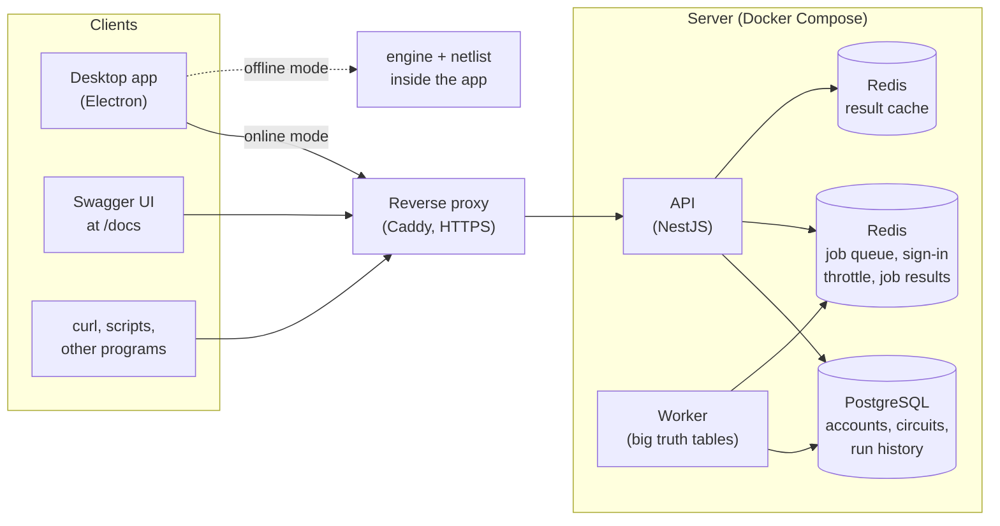
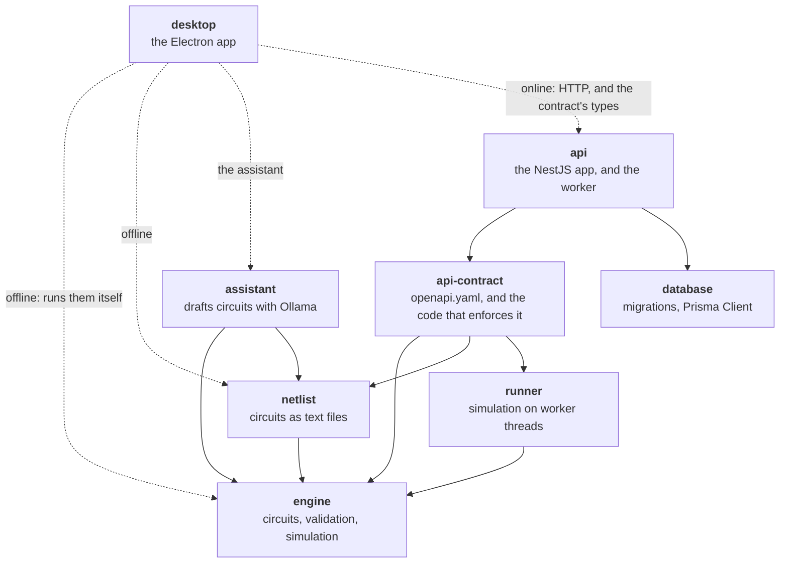
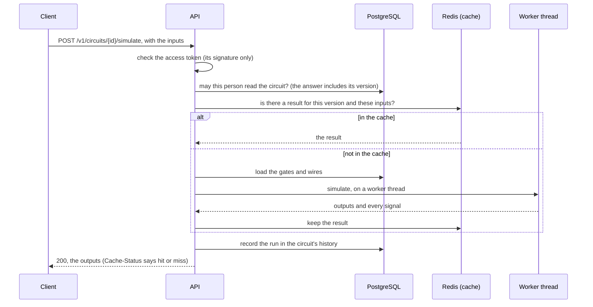
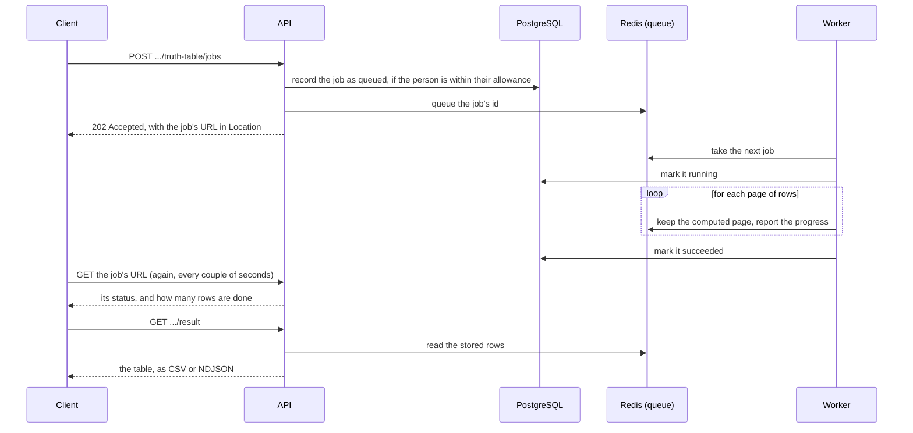

# How CircuitLab fits together

Three pictures, from far to near: what talks to what when it runs, which package builds on which,
and what happens during one request. Each links to the document that explains the details.

## What runs, and what talks to what

- **The desktop app has two modes.** Online, it calls the API like any client. Offline, it runs the
  engine and the netlist reader itself, with circuits saved on the computer
  ([desktop-app.md](desktop-app.md)).
- **The API is one program that serves everyone.** It keeps nothing between requests, so any number of
  copies can run side by side ([system-design.md](system-design.md)).
- **The worker is the same program started differently.** It computes truth tables too big for one
  response, from a queue in Redis, so the API's answers never wait for them
  ([caching-and-jobs.md](caching-and-jobs.md)).
- **PostgreSQL keeps what must last,** Redis what only needs to last a while or be shared by every
  copy ([database-design.md](database-design.md)). In the development setup (`docker compose up`)
  both kinds of Redis data share one Redis; the production file gives the cache a Redis of its own,
  which may forget old entries.
- **The reverse proxy exists only in production.** It adds HTTPS and tells the API each client's
  address ([deploy.md](deploy.md)). Locally, clients talk to the API directly.

## Which package builds on which

An arrow means "uses". Everything points toward the engine, which uses nothing.

- **The API also uses the engine, the netlist reader and the runner directly.** Those arrows are left
  out so that the picture stays readable.
- **The engine is pure TypeScript,** with no Node or framework imports, so it runs anywhere: in the
  worker threads, in the API, in the desktop app's main process.
- **The contract is the source of truth for the API.** `openapi.yaml` states every endpoint, and the
  code in `api-contract` validates requests against it. The app serves it as it is
  ([api-design.md](api-design.md)); the test client checks every response against it
  ([testing.md](testing.md)); Swagger UI at `/docs` shows it.
- **The database package depends on nothing at run time but Prisma.** Its migrations are SQL
  written by hand.

## One simulation, from request to answer

- **The access check always comes first,** even for a cached answer. A cache hit skips the heavy
  part (loading the circuit, the worker thread), never the question "may this person see it?".
- **The circuit's version is part of the cache key,** so a changed circuit is never answered from
  an old result, and nothing has to be invalidated.
- **A cached answer is still a run.** It is recorded in the history, which costs a database write
  ([system-design.md](system-design.md) measured it).

## One big truth table, as a background job

A table too big for one response is computed in the background. The client asks, gets a URL, and
polls it.

- **The database record is the truth about a job;** the queue only delivers. If Redis lost the
  queue, no job would claim a result it doesn't have.
- **A worker that dies loses nothing:** its job goes back to the queue and another worker takes it.

## Where each kind of state lives

| State | Where | Why |
| --- | --- | --- |
| Accounts, circuits, sessions, run history, job status | PostgreSQL | Must last, and is queried by relations |
| Cached results, sign-in failure counts, address limits, the job queue, job results | Redis, or the API's memory without `REDIS_URL` | Short-lived, shared by every copy, needs expiry and atomic counters |
| Circuits saved offline, settings, recent files | The desktop app's own folder | Works with no server |
| Nothing | The API process itself | So any copy can answer any request |

## Ways to run it

| Setup | Command | What it is for |
| --- | --- | --- |
| Everything in memory | `npm run start:api` | Trying the API in seconds; everything is lost when it stops |
| PostgreSQL and Redis in Docker | `docker compose up --build` | Development, and a look at how production runs ([docker.md](docker.md)) |
| On a server, behind HTTPS | `docker compose -f docker-compose.yml -f docker-compose.prod.yml up -d --build` | A demo others can reach ([deploy.md](deploy.md)) |
| The desktop app, offline | `npm run dev:desktop` | Drawing and testing circuits with no server at all |
