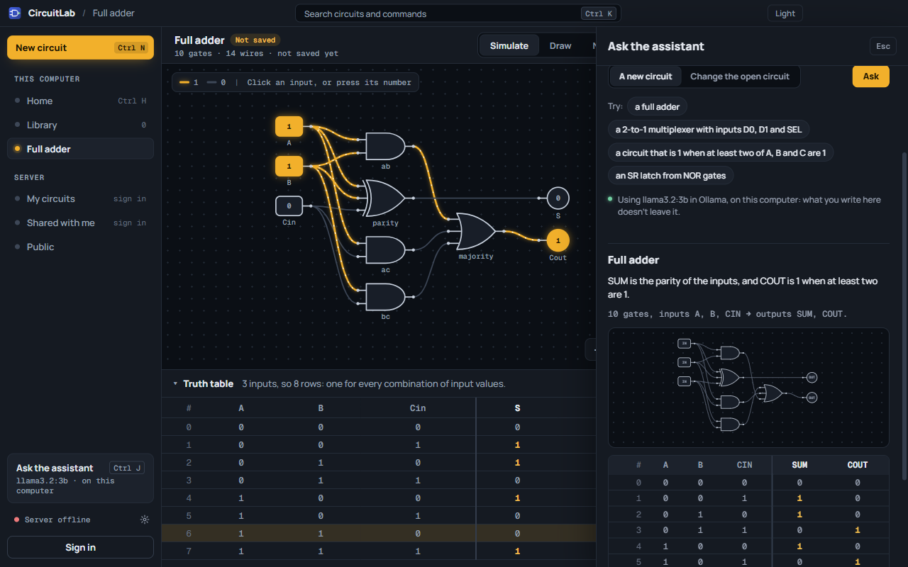

# The assistant

A panel in the desktop app (Ctrl+J). You describe a circuit in words ("a 2-to-1 multiplexer
with inputs D0, D1 and SEL"), and a language model drafts it. The model runs in
[Ollama](https://ollama.com) **on your own computer**: nothing you write goes to a cloud service or to
CircuitLab's server.

It is a **draft maker, not an oracle**. A small local model makes mistakes, so the app never puts
anything in your circuit by itself: it checks the draft, shows how it behaves (its truth table), and
waits for you to press "Use this in the editor".

<p align="center">
  
</p>

```bash
npm run dev:desktop                          # the app; Ctrl+J opens the assistant
npm run eval:assistant                       # how good is the model you have? (needs Ollama running)
npm run eval:assistant -- llama3.2:3b        # the same, for one model by name
```

It's one panel that slides in over any screen: press **Ctrl+J**, click **Ask the assistant** at the
bottom of the sidebar or on the home screen, or choose **More > Ask the assistant to change it** on
an open circuit. It works offline and online, since it only fills in the workspace.

## What it does

1. You write a request, and choose *a new circuit* or *change the open circuit*.
2. The app asks the model, checks the answer, and (if the answer has mistakes it can find) asks again,
   up to three times. This takes about a second with a GPU.
3. You see a **draft**: the model's one-sentence idea, the gates and inputs and outputs, a drawing, the
   whole truth table (up to 4 inputs), and the netlist.
4. **Use this in the editor** opens it in the workspace, not saved yet; **Use this in the open circuit**
   replaces the open circuit with it (with **Undo**). Then check it and save as usual. **Discard** throws
   it away.

If Ollama isn't running, the panel says so and how to fix it; if the model can't do it, it says that
too, with the model's own words.

## How it fits together

```
┌── the window ──────────────────────────┐
│ src/assistant/drawer.ts                │   asks, shows the draft, puts it in the workspace
│ src/assistant/settings-card.ts         │   Ollama's address, the model
└────────────┬───────────────────────────┘
             │ window.circuitlab.askAssistant(...)   (the bridge: electron/bridge.ts)
┌────────────▼───────────────────────────┐
│ main process: electron/assistant.ts    │   which model; prepares the draft and its truth table
└────────────┬───────────────────────────┘
             │ @circuitlab/assistant        (packages/assistant, plain TypeScript)
┌────────────▼───────────────────────────┐        HTTP
│ designCircuit: prompt, ask, check, retry│ ─────────────────▶  Ollama on this computer
└─────────────────────────────────────────┘                     (http://127.0.0.1:11434)
```

The window never talks to Ollama itself. It may only call the functions in the bridge, and Ollama is
another address anyway; the main process is also where the settings live.

## The decision that mattered: what the model writes

The obvious design is to ask the model for the netlist. **That doesn't work with a small model.** The
only model installed on the computer this was built on is `llama3.2:3b` (3.2 billion parameters, 2 GB),
so that is what was measured. Early experiments, with 10 to 12 requests that the prompt had no example
for (throwaway scripts, not kept in the repository):

| What the model was asked to write | Circuits that were right |
| --- | ---: |
| A netlist, one gate per line | 1 to 3 of 10 |
| A JSON list of gates, each with a name and the names of its inputs | 2 of 10 |
| A JSON description with a formula for each output, written as nested gate calls | 0 of 12 |
| Formulas with `&`, `\|`, `^`, `!` only | 3 of 12 |
| **Formulas that can also count and compare** (`A + B + C >= 2`, `SEL ? D1 : D0`) | **6 of 12** |
| The same, plus example rows of its own, checked against its formulas | 2 of 12 |

Two things stand out:

- **A small model can't wire gates.** It writes `AND(AND(A, B), C)` where the format needs one gate per
  line, forgets the `OUTPUT` lines, and invents names. Telling it what the parser said was wrong
  didn't help: `expected "," or ")", but found "(A,"` means nothing to it, and its three retries made
  the same mistake (3 of 10 valid before the retries, 3 of 10 after).
- **It is much better at saying what a circuit computes.** "At least two of A, B and C" is
  `A + B + C >= 2`: one line, in notation it has seen millions of times.

So the model writes **a name and a formula for each output**, and the program does the rest, exactly:
it chooses the gates, names and wires them, and reads the result back with the real netlist parser.
There is no way for the model to wire something wrongly, because it doesn't wire anything.

The last experiment is worth a sentence. Asking the model for example rows, and checking its formulas
against them, made things *worse* (6 right became 2): the model gets its own example rows wrong, so the
check rejected correct formulas. A check is only as good as what it checks against.

## How a request is handled

[packages/assistant](../packages/assistant/src), in order:

1. **The prompt** ([prompt.ts](../packages/assistant/src/prompt.ts)): a short format description, and the
   **three recipes** most like the request ([cookbook.ts](../packages/assistant/src/cookbook.ts)), chosen
   by keywords. A small model copies a worked example far better than it follows rules; with five
   examples it started copying their details instead (a pointless NAND gate turned up in nearly every
   answer), so three is what a prompt gets. There are 16 recipes (adders, subtractor, multiplexers,
   decoder, comparators, majority, parity, latches, XOR from NANDs, ...). Every one is checked against
   ordinary code in the tests, so what the model copies is right.
2. **Ask** ([ollama.ts](../packages/assistant/src/ollama.ts)): `POST /api/chat`, with Ollama's
   structured output (a JSON schema), so the reply is always JSON of the right shape. Temperature 0.2, a
   memory of 8,192 tokens that we set (Ollama would otherwise cut off what doesn't fit, silently), and
   at most 1,024 tokens of answer.
3. **Formulas** ([formula.ts](../packages/assistant/src/formula.ts)): `A ^ B ^ CIN`,
   `A + B + CIN >= 2`, `S1 ? (S0 ? D3 : D2) : (S0 ? D1 : D0)`, and the gates as functions:
   `NAND(A, B)`. It is a small part of what JavaScript and C accept, because that is what models know.
   It refuses what is unclear: `A & B == C` means different things in C and Python, so the model has to
   add parentheses.
4. **Build** ([build.ts](../packages/assistant/src/build.ts)): a formula made of `& | ^ !` and gates becomes those
   gates one for one (`A ^ B ^ CIN` is one XOR with three inputs). A formula with arithmetic,
   comparisons or `?:` says what is computed but not how: its truth table is worked out, and the
   fewest AND-terms for it are found ([minimize.ts](../packages/assistant/src/minimize.ts), the
   Quine-McCluskey method). A parity comes out as one XOR. The same gate is built once, however many
   formulas use it. **Latches** are written as *signals* that use each other
   (`q = NOR(R, qbar)`, `qbar = NOR(S, q)`), which the builder wires as the feedback loop it is.
5. **Check** ([checks.ts](../packages/assistant/src/checks.ts)): mistakes a program can see for sure,
   that need no idea of what the circuit should compute:
   - a name or a range the request gives, like "outputs Y0 to Y7", that the circuit doesn't have;
   - "using **only** NAND gates" with other gates in the circuit;
   - a feedback loop that never settles (a latch whose gates feed themselves).
6. **Retry**: every problem found in steps 3 to 5 is a plain sentence that names the formula and says
   what to do (`The part A + B of the formula for “Y” gives 2 when A=1 B=1, but only 0 and 1 are
   allowed. To count something, compare it: write A + B >= 1`). The model gets its own answer back with
   those sentences, up to three answers in all. Only the latest answer goes back, so a conversation
   can't grow past the model's memory.

**Changing a circuit** shows the model the circuit in its own format: the open circuit's netlist is
turned back into names and formulas ([describe.ts](../packages/assistant/src/describe.ts), tested by
describing and rebuilding 33 circuits, random ones included, and comparing their behaviour), and the model
answers with the complete new circuit. Gate names inside the circuit aren't kept, because only what the
gates compute is.

## How good is it?

Measured with `npm run eval:assistant`: 32 requests, each checked against ordinary code over every row
of the truth table (the latches by stepping through them). `llama3.2:3b` on an RTX 3060 laptop GPU,
temperature 0.2, up to 3 attempts, one run:

| Requests | How many | Valid netlist | Right | Right on the first try |
| --- | ---: | ---: | ---: | ---: |
| In the cookbook, but worded differently and with other names | 16 | 15 | 12 | 12 |
| In no recipe | 10 | 9 | 3 | 3 |
| "Change this circuit" | 6 | 6 | 2 | 2 |
| **All** | **32** | **30** | **17** | **17** |

The median request took 1.1 seconds. The first one after Ollama has been idle is slower (6 to 13
seconds here) while the model loads.

What to take from it, honestly:

- **About half is right, and it is not the retries that make it so.** Retries fix what a program can
  see is wrong (a missing name, a gate that isn't allowed); a circuit that is valid but computes the
  wrong thing looks fine to the program. Only the truth table shows that, which is why the draft shows
  it.
- **It is good at the usual exercises and weak at new ones.** 12 of 16 for things a recipe is close to;
  3 of 10 for things no recipe covers; 2 of 6 for changes (it tends to rewrite the circuit instead of
  changing it).
- **The checks mostly make failures honest.** Before them, an SR latch whose gates fed themselves was
  presented as a valid circuit; now it's reported as a failure after three tries. The count of right
  answers barely moved (16 to 17, which is within the run-to-run noise: expect a point or two).
- **A bigger model should do better, and this is how to find out.** Any model you have downloaded works:
  `ollama pull` one, choose it in Settings, and run `npm run eval:assistant -- <name>`. Nothing here has
  been measured with a model other than `llama3.2:3b`.
- **It's 32 requests, one run, one seed.** The recipes are in the first group by construction (the group
  measures finding and adapting them); only the second group says how it does on something new.

## Privacy and safety

- **The model is untrusted, and has no powers.** It can only return text. The app uses that text as a
  *formula*, which it reads with its own parser (never `eval`), builds a netlist from, and reads back with
  the netlist parser. Nothing the model writes is run, opened, or shown as HTML.
- **Nothing reaches the circuit without you.** The draft goes into the workspace only when you press
  "Use this", unsaved, and the workspace's own Check and Save still apply (Undo restores what was there).
- **It stays on your computer** when Ollama does: the panel says "on this computer: what you write here
  doesn't leave it". If you point it at another address, the panel says "which is not this computer:
  what you write here is sent there", instead.
- **Limits:** a request is at most 1,000 characters; a netlist to change at most 200,000 characters and
  80 gates; an answer at most 1,024 tokens; a wait for one answer at most 120 seconds (the model may be
  too big for the computer, or the GPU may be busy with something else: it stalled for the length of
  that wait while a game was running during development); three answers per request; a circuit of at
  most 16 inputs, and at most 8 inputs inside one arithmetic or comparison formula.
- **The window can't choose where requests go.** The address is a setting, checked by the main process
  (http or https, nothing else), and Cancel stops the request.

## Settings

**Settings > Assistant**: Ollama's address (default `http://127.0.0.1:11434`) and the model. The list of
models is what Ollama says it has (newest first), so there's nothing to type, and "Automatic" means the
newest. A model you chose and later removed stays in the list marked "(not installed)", and the
assistant falls back to the newest meanwhile and says so. `CIRCUITLAB_OLLAMA_URL` overrides the address
for one run (the smoke test uses the Settings screen instead, like a person would).

## Testing

- **Unit tests**, in `npm test` and CI, with no Ollama and no GPU (189 in
  [packages/assistant/test](../packages/assistant/test), more in
  [apps/desktop/test](../apps/desktop/test/assistant.test.ts)):
  - the formula language, the minimizer (all 256 tables of up to 3 inputs, and random ones up to 8),
    and the builder, whose circuits are compared with ordinary code, row by row, through the real engine;
  - every recipe, against its own reference;
  - describing a circuit and building it again, for 33 circuits;
  - the retry loop with a scripted model: what is sent back, that it stops after three, that a refusal
    isn't retried, that the checks trigger a retry;
  - the Ollama client against a fake web server: every way it can fail (not running, model missing, an
    error, not Ollama, too slow, cancelled) has its own message.
- **The smoke test** drives the real app against a fake Ollama (the same HTTP API, a canned answer):
  Settings, drafting a circuit offline and online, using it, changing a circuit and undoing, Cancel, a
  refusal, an empty request, Ollama not running, and the settings being kept.
- **The evaluation** (`npm run eval:assistant`) is the only thing that needs a real model, so it is
  not in CI.

## Known shortcuts

| Shortcut | Why it's acceptable for now | The proper fix |
| --- | --- | --- |
| One question at a time, with no conversation: "now make it 3 bits" starts over | The draft and the editor are the memory; changing a circuit is its own mode | Keep the last few requests and answers |
| The answer arrives whole, with no streaming | An answer takes about a second with a GPU, and every one is checked as a whole anyway | Stream while it's drafted, check at the end |
| The 3B model is right about half the time, and weaker on new things | It's the model there is; the truth table is shown for that reason | Try a bigger model (see above), and add recipes |
| Only "only NAND" and "only NOR" are understood as limits on the gates | The two classic exercises | Read "only AND, OR and NOT", "at most N gates", ... |
| Circuits with feedback are a loop of signals, one gate each; flip-flops are not in the recipes | The two latches cover how it's written | A recipe for a D flip-flop (master and slave latches) |
| A circuit is rebuilt from formulas, so the gates of a circuit being changed are renamed | Only what the gates compute is kept | Ask the model for edits to the formulas, and keep the rest as it was |
| Ollama has to be running; the app doesn't start it | Starting other programs is intrusive | Offer to start it, on request |
| Ollama only | It's what was asked for, and its API is simple | Another `LanguageModel` (an interface of one function: `chat`) |
