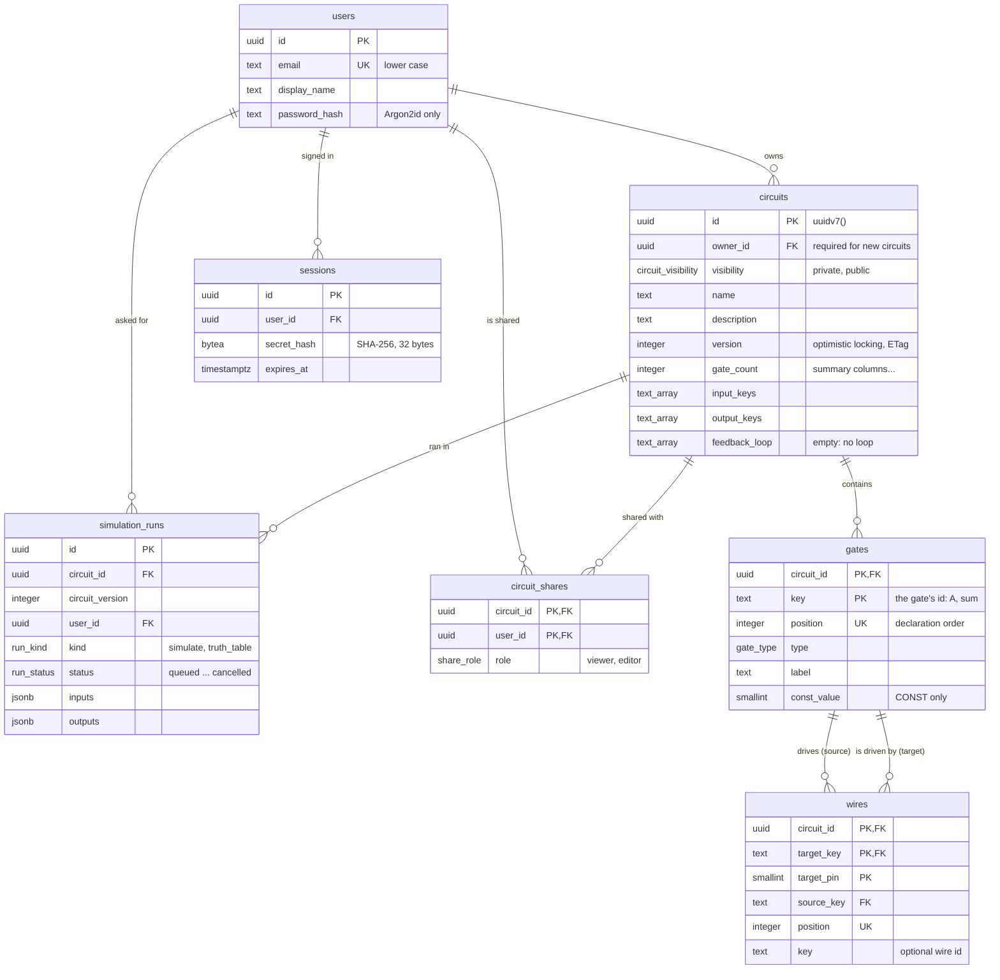
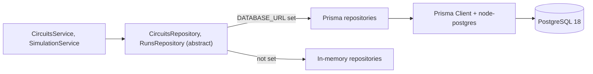

# CircuitLab database design (phases 5 to 9)

The schema is the SQL migrations in
[`packages/database/prisma/migrations`](../packages/database/prisma/migrations) (PostgreSQL 18),
described for Prisma Client by [`schema.prisma`](../packages/database/prisma/schema.prisma). The
statements behind the API are in [`queries.sql`](../packages/database/queries.sql).
`npm run db:check` applies the migrations to a real PostgreSQL 18, tests the constraints and the
queries, and checks that `schema.prisma` matches. That database is PGlite: Postgres compiled to
WebAssembly, running inside Node, so there's nothing to install.

Phase 5 designed the schema; phase 6 connected the API to it (see
[Connecting the API: Prisma](#connecting-the-api-prisma-phase-6)); phase 7 added accounts, sharing,
and sessions (see [Accounts and sharing](#accounts-and-sharing-phase-7), and
[auth-design.md](auth-design.md) for the rules).



## Gates and wires are tables, not a JSON column

A circuit could be stored as one `jsonb` document; reading and writing it would be simpler. Rows
were chosen because then the database itself guarantees the circuit's structure:

- a gate key is unique within its circuit (a primary key);
- every wire's ends exist (foreign keys);
- a pin has at most one wire (a primary key);
- a CONST has a 0 or 1 value (a CHECK).

Rows also make questions answerable in SQL, such as "which circuits use XOR gates?".

The cost: replacing a circuit deletes and re-inserts its rows, and reading one takes three
indexed queries. With at most 10,000 gates per circuit, both are cheap: each gate list and each
wire list goes in as a single multi-row `INSERT`.

## Keys

- **Circuits, users and runs** have UUIDv7 ids (`uuidv7()`, new in PostgreSQL 18).
  - **Time-ordered:** new rows land at the end of the index instead of at random places, which
    keeps the index compact.
  - **Not enumerable:** they can't be guessed the way 1, 2, 3 can.
  - **Trade-off:** they reveal roughly when a row was created.
- **Gates** use the key the user gave them (`A`, `sum[3]`), together with the circuit id:
  `PRIMARY KEY (circuit_id, key)`.
- **Wires** refer to gates through `(circuit_id, source_key)` and `(circuit_id, target_key)`.
  Because the circuit id is part of both foreign keys, a wire can't connect gates of two different
  circuits. A separate numeric gate id couldn't guarantee that.
- **A wire's primary key is `(circuit_id, target_key, target_pin)`.** The engine's "a pin driven
  by two wires" error then can't even be stored.

## What the database enforces, and what stays in the engine

| Rule | Where it is enforced |
| --- | --- |
| Unique gate keys, wires between existing gates of the same circuit, one wire per pin, one share per person and circuit | Primary and foreign keys |
| Key format (netlist-safe, ≤ 64 characters), pins 0–63, CONST value 0 or 1 and only on CONST gates, name and label lengths, an owner for every new circuit, a 32-byte session hash | CHECK constraints |
| Visibility, share roles | Enum types |
| Pin count per gate type, unconnected pins, wires driven by an OUTPUT, feedback loops | The engine, before every write |
| The owner isn't also one of a circuit's share recipients; who may do what | The API (`circuit-access.ts`) |

**Why the split:** the database checks what concerns one row, or a key between rows, which is
cheap and complete. Rules about the circuit as a whole need the whole graph, and they already live
in one place, the engine (phase 1). Repeating them in triggers would mean two copies of the same
rules that could drift apart.

`npm run db:check` tries 30 bad rows, and each is refused by the expected rule. It also checks that
the `gate_type` and `simulation_mode` enums list exactly the engine's gate registry and simulation
strategies (phase 9), so adding a gate type without its migration fails the check. And it runs every
one of the 29 named queries in queries.sql, and fails if one was never run.

## Order is data

`gates.position` and `wires.position` store the order a circuit was sent in, and they matter:
- **Gate order is a truth table's column order** (the row number spells out the inputs in that
  order).
- **It breaks ties in evaluation order.**
- **The API returns a circuit exactly as it was sent,** so ETags and client diffs stay stable.

Positions are unique per circuit and come from the array order on insert (`WITH ORDINALITY`).

## Versions and optimistic locking

`circuits.version` starts at 1 and goes up with every change, and it's also the API's ETag. When
the client sends `If-Match` with the version it edited, the write names that version:

```sql
UPDATE circuits SET ..., version = version + 1 WHERE id = $1 AND version = $2
```

If no row changes, someone else got there first, and the API answers 412 instead of overwriting
their work. Without `If-Match` the client accepts "last write wins": the same UPDATE runs without
the version condition, so it can't lose a race. Either way the UPDATE locks the row until the
transaction ends, so two replacements can't interleave. `npm run db:check` replays two people
editing one circuit.

Only the latest version of a circuit is stored. A simulation run records which version it used.

## Summary columns: derived data, on purpose

`gate_count`, `wire_count`, `input_keys`, `output_keys` and `feedback_loop` repeat what the gates
and wires imply, so a list page reads one table instead of thousands of gate rows.
- **Written by:** the engine computes them, and they're written in the same transaction as the
  gates and wires.
- **If they ever go stale:** they can be recomputed from the gates and wires at any time.

## Indexes follow the queries

| Query (queries.sql) | Index |
| --- | --- |
| Someone's circuits, in each list order, and the pages after a cursor | `circuits (owner_id, created_at, id)`, `(owner_id, updated_at, id)`, `(owner_id, name, id)`; also serve the foreign key |
| Public circuits, in each list order | The same three without `owner_id`, as partial indexes `WHERE visibility = 'public'`: they hold only public circuits, so they stay small however many private ones there are |
| Circuits shared with someone | `circuit_shares (user_id, circuit_id)`, then each circuit by its primary key |
| Name search (`q=adder` becomes `ILIKE '%adder%'`) | `gin (name gin_trgm_ops)`, a trigram index; a B-tree can't serve a leading `%` |
| A user's sessions; expired sessions | `sessions (user_id)`, `sessions (expires_at)` |
| A circuit's gates and wires, in order | The unique `(circuit_id, position)` indexes |
| Wires by source (fan-out; deleting a gate) | `wires (circuit_id, source_key)` |
| A circuit's or a user's recent runs | `simulation_runs (circuit_id, created_at DESC)`, `(user_id, created_at DESC)` |
| Unfinished runs (phase 10's job queue) | A partial index `WHERE status IN ('queued', 'running')`, which stays small however long the history grows |

**Cursor vs OFFSET.** The cursor pagination designed in phase 3 is a row comparison:
`WHERE (created_at, id) < ($cursor_time, $cursor_id)`. In `db:check`, with 50,000 circuits of
which 12,500 are public, page 500 of the public list takes about 0.1 ms by cursor and 8 ms by
`OFFSET` (about 60 times slower), because OFFSET reads and discards every earlier row. The gap
grows with the table.

**Collation.** Names and keys use the `"C"` collation, so they sort by character code. That's the
order the API's cursors assume, and it doesn't depend on the server's language settings.

## Users

- **Email:** stored in lower case (a CHECK insists), so a plain unique constraint means one
  account per address, however it's typed.
- **Passwords:** only a hash fits. A CHECK accepts only the Argon2id format (the hashing scheme
  OWASP recommends), so a bug that tried to store a password in plain text fails loudly instead of
  leaking it.
- **Ownership:** every circuit written since phase 7 has an owner (see below).

## Simulation runs

A run records which circuit was simulated, at which version, by whom, what was asked, and how it
ended.
- **`kind`:** `simulate` (inputs and outputs as `jsonb`) or `truth_table` (a row range; tables are
  too big to store, and phase 10 decides where background results go).
- **`status`:** `queued`, `running`, `succeeded`, `failed` or `cancelled`. That covers today's
  synchronous runs and phase 10's background jobs, so phase 10 won't need a new status.
- **CHECKs tie fields to kind and status.** For example, a succeeded simulation has outputs, a
  failed run has an error code, and a queued run hasn't started.

**A lesson the check taught.** A CHECK rejects a row only when its condition is false, and a
comparison with NULL is unknown, neither true nor false. Written as `row_offset >= 0`, the rule let
a missing `row_offset` through. Every "must be present" now says `IS NOT NULL` explicitly, and the
check has a test case for each one.

## Deleting

| Deleted | Effect |
| --- | --- |
| A circuit | Its gates, wires and runs go with it (`ON DELETE CASCADE`) |
| A gate | The wires attached to it go too |
| A user | Their circuits, the shares they received, and their sessions are deleted; their runs of other people's circuits stay, with `user_id` set to NULL, so circuit owners keep their history |

## Connecting the API: Prisma (phase 6)

With `DATABASE_URL` set, the API keeps circuits and simulation runs in PostgreSQL through Prisma
7.10 (the latest stable release; npm's `latest` tag points at an 8.0 release candidate). Without it,
the API keeps them in memory, as before.



**The services didn't change.** They depend on abstract repositories, and `StorageModule` picks the
implementation at startup. The in-memory ones follow the same rules (list order, cursors, optimistic
locking), so the API answers the same way with either.

### Migrations: SQL first, `schema.prisma` second

The usual Prisma workflow writes `schema.prisma` and lets `prisma migrate dev` generate the SQL.
That doesn't work here: Prisma's schema language can't express CHECK constraints, the partial
index, or the `"C"` collation, so a generated migration would silently drop the rules the database
is there to enforce. So it goes the other way:

1. **Migrations are written by hand** in SQL and applied with `prisma migrate deploy`
   (`npm run db:migrate`), which records each one in a `_prisma_migrations` table and never applies
   one twice.
2. **`schema.prisma` describes the same tables** for Prisma Client: names mapped with `@map`,
   `uuidv7()` ids as `@default(dbgenerated("uuidv7()"))`, the trigram index as
   `@@index(..., type: Gin)`.
3. **A drift check keeps them honest.** `npm run db:check` runs
   `prisma migrate diff --from-config-datasource --to-schema prisma/schema.prisma --exit-code`
   against the migrated database. Any difference fails the check.

An applied migration is never edited; a change is a new migration. There are five:

| Migration | What and why |
| --- | --- |
| `20261001000000_init` | Phase 5's schema, plus a direct `wires → circuits` foreign key so Prisma can load a circuit's wires (the composite gate keys already implied it) |
| `20261001120000_feedback_loop_empty_array` | "No feedback loop" becomes an empty array instead of NULL |
| `20261001180000_millisecond_timestamps` | Timestamps stored to the millisecond (`timestamptz(3)`) |
| `20261001210000_accounts_and_sharing` | Phase 7: owners, visibility, shares, sessions, and the new list indexes |
| `20261001230000_simulation_mode` | Phase 9: each run's `mode` (`combinational` or `sequential`, earlier runs combinational), and a CHECK that truth tables are combinational |

The second and third came from bugs found while connecting Prisma:

- **Prisma treats array columns as never NULL.** It reads NULL back as `[]` and won't write NULL,
  so there was no way to clear a circuit's feedback loop through Prisma. Now an empty array means
  "no loop", and the CHECK says `cardinality(feedback_loop) <> 1` (empty, or a real loop, which
  names at least two gates).
- **JavaScript dates stop at milliseconds; PostgreSQL keeps microseconds.** A list cursor carries
  the last circuit's `created_at` as a JavaScript date, so it was slightly earlier than the stored
  value. A circuit created later in that same millisecond then compared as "newer than the cursor",
  and the next page skipped it. Storing only what the application can represent made cursors exact
  again. `npm run db:check` creates three circuits within one millisecond and pages through them
  one at a time; with microsecond timestamps, only one of the three ever showed up.

### Queries

- **Most queries use Prisma's query API:** `findUnique` with the gates and wires `include`d in
  position order, `createMany` for gate and wire lists, and `$transaction` around every write that
  touches more than one table.
- **Optimistic locking** is `updateManyAndReturn({ where: { id, version } })`. Zero rows back means
  the version had moved on (412), or the circuit is gone (404).
- **The list query is SQL, through `$queryRaw`.** Cursor pages need a row comparison,
  `(created_at, id) < ($time, $id)`, which PostgreSQL turns into one index range scan. Prisma's query
  API can only express it as `created_at < $time OR (created_at = $time AND id < $id)`, which can't
  start the scan at the cursor, so every page would reread the ones before it. The tagged template
  still sends every value as a parameter, never as SQL text.
- **Ids that aren't UUIDs** get a 404 without asking the database, which would reject them as
  invalid `uuid` values.

### When the database is unavailable

- **At startup** the API checks that it can reach the database and that every migration it expects
  has been applied (compared with `_prisma_migrations`), and refuses to start with one clear line
  otherwise. For example: "Cannot reach the database at 127.0.0.1:5433/postgres. Is it running?",
  or "... is missing a migration this version needs (20261001210000_accounts_and_sharing). Apply
  it: npm run db:migrate". Messages name the host, never the password.
- **While running,** a lost database answers 503 `server-unavailable` with `Retry-After: 5`: the
  request may well work shortly, and it isn't a bug in the API. `/health` reports
  `"storage": { "kind": "postgresql", "reachable": false }` with a 503, so a load balancer can stop
  sending traffic. When the database comes back, the API recovers by itself.
- **Recording a simulation run is best effort.** If it fails, the simulation's answer is still
  returned and the failure is logged.

### The local database

`npm run db:start` serves PGlite on port 5433 through pglite-socket, so Prisma and the API connect
to it like to any PostgreSQL server. One limitation: PGlite is a single session that pglite-socket
shares between connections, and the messages of parameterized queries from different connections
can interleave. The API must therefore use one connection with it, `DATABASE_POOL_SIZE=1` (set in
`.env.example`). A real PostgreSQL server, as in phase 11's Docker setup, has no such limit.

The same server is a library, `startLocalPostgres()` in `@circuitlab/database/local`. The tests use
it to give each PostgreSQL test file a fresh database, migrated with `prisma migrate deploy`.

## Accounts and sharing (phase 7)

The rules are in [auth-design.md](auth-design.md). What they need from the database:

- **Every new circuit has an owner.** The rule is a CHECK added `NOT VALID`: it holds for every row
  written from now on, but doesn't fail on circuits stored before accounts existed. Those keep no
  owner and stay private, so nobody sees them, and the migration neither fails nor deletes them.
  Once they have owners, `VALIDATE CONSTRAINT` and `SET NOT NULL` complete the change. `db:check`
  stores such a circuit before the migration and shows it surviving, with `VALIDATE` refused while
  it exists. This is the usual way to tighten a rule on a table that already has data.
- **`visibility`** is an enum (`private`, `public`), private by default.
- **`circuit_shares`** has one row per circuit and person (its primary key), with the role.
  - **The owner can't be one of the recipients.** That rule compares two tables, so the API checks
    it.
  - **Sharing again updates the row** (`INSERT ... ON CONFLICT DO UPDATE`). `xmax = 0` in
    `RETURNING` tells a new row from an updated one, so the API can answer 201 or 200.
- **`sessions`** holds one row per signed-in device: the SHA-256 hash of its refresh token's current
  secret, never the secret.
  - **Refreshing is one compare-and-swap `UPDATE`**
    (`... WHERE id = $1 AND secret_hash = $old AND expires_at > now`), so of two refreshes with the
    same token only one succeeds.
  - **The CHECKs:** a hash is exactly 32 bytes, and a session can't expire before its last refresh.
- **The list indexes changed with the lists.** Every list is now someone's circuits, someone's
  shared circuits, or the public ones, so the indexes over all circuits went and indexes per scope
  came (see [Indexes follow the queries](#indexes-follow-the-queries)).
- **`db:check`'s 50,000-circuit test needed fresh statistics.** It inserts 1,000 users and 50,000
  circuits, which took over ten minutes after the earlier sections had run, and 8 seconds with
  `ANALYZE` between the inserts. That much was measured, both ways.
  - **The likely explanation:** PostgreSQL keeps one plan per session for each foreign-key check,
    and the plans made while the tables held a handful of rows suit tiny tables. New statistics
    make it plan again.
  - **On a real server,** autovacuum updates statistics as tables grow; PGlite has no autovacuum.

## For the next phases

**Phase 12 (scale)**
- **`simulation_runs` grows fastest.** It needs a retention policy, and at large scale it can be
  partitioned by month, so dropping old history is instant.
- **Reads:** circuit reads can go to read replicas.
